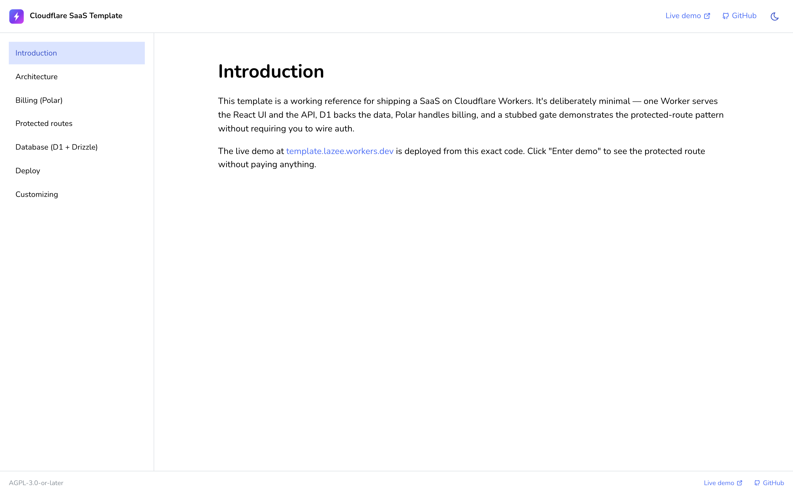

# Cloudflare SaaS Template

A reference SaaS on Cloudflare Workers: React + Mantine on the front, Hono on a single Cloudflare Worker, D1 + Drizzle for data, Polar for billing. One origin, one deploy, zero infra ops. TypeScript everywhere.

**Reference deployment** (maintained from this repo):

- App: https://template.lazee.workers.dev
- Docs: https://template-docs.lazee.workers.dev

[](https://deploy.workers.cloudflare.com/?url=https://github.com/aloewright/my-cf-template)
&nbsp;
[](https://github.com/aloewright/my-cf-template/releases)
&nbsp;
[](./CHANGELOG.md)




---

## What's inside

- 🚀 **Single Worker** serves both the React SPA and the Hono API from one origin — no CORS, one `wrangler deploy`.
- 💳 **Polar billing** end-to-end: checkout → success redirect → webhook → subscription rows in D1.
- 🔓 **Stub-gated `/dashboard`** with a no-payment **Enter demo** button so visitors can explore the protected route without buying.
- 🗄️ **Cloudflare D1 + Drizzle ORM** with migrations.
- 🔐 **Better Auth scaffolded** in `worker/src/auth.ts` — swap-in instructions in the docs site.
- 📚 **Standalone docs site** in `docs/` (React + Mantine + MDX), deployed as a separate Worker.
- ☁️ **One-click "Deploy to Cloudflare"** badge — auto-provisions D1 on first deploy.
- 🤖 **GitHub Actions auto-deploy** + **Dependabot** weekly.
- 🌗 **Dark mode toggle**, **Nunito** typography, custom logo, refined **Tabler icons**.

---

## Tech Stack

| Layer | Choice | Why |
| --- | --- | --- |
| **Runtime** | Cloudflare Workers (`workerd`) | One process serves both the SPA and the API from edge POPs |
| **Frontend** | React 19 + Vite 8 (Rolldown / Oxc) | Modern React, instant HMR, ~100 ms production builds |
| **Routing** | TanStack Router | File-less, type-safe routes with full inference |
| **Data fetching** | TanStack Query | Cache + revalidation primitives for client state |
| **UI components** | Mantine 9 (core, hooks, notifications, modals, form) + Tabler icons | Full component library; dark-mode aware via CSS variables |
| **Styling** | Tailwind CSS 4 + Nunito | Utility CSS via the new Vite plugin; Nunito loaded from Google Fonts |
| **API** | Hono | Tiny, fast router that matches the Workers fetch handler |
| **Database** | Cloudflare D1 (SQLite at the edge) | Pay-per-row, zero-config, replicated |
| **ORM** | Drizzle | Schema-first, generates SQL migrations, runs in `workerd` |
| **Billing** | Polar (`@polar-sh/sdk`) | Merchant of record — checkout sessions + webhook verification |
| **Auth (scaffolded)** | Better Auth | D1-backed sessions, email+password ready — not wired in the reference deployment |
| **Lint / Format** | Biome 2.4 | One tool, Rust-fast, replaces ESLint + Prettier |
| **Build** | Vite 8 (Rolldown / Oxc) + `tsc --noEmit` | Type-check both client and worker tsconfigs |
| **Deploy** | Wrangler 4 | Worker + assets in a single deploy |
| **CI** | GitHub Actions + Dependabot | Auto-deploy on push to `main`; weekly dep bumps |

---

## Architecture

```
        ┌──────────────────────────────────────────────────────┐
        │              Single Cloudflare Worker                │
        │  https://<worker>.<account>.workers.dev              │
        │                                                      │
        │  fetch handler (Hono)                                │
        │  ├─ /api/health             → JSON                   │
        │  ├─ /api/session            → { unlocked }           │
        │  ├─ /api/demo/unlock        → set cookie             │
        │  ├─ /api/checkout           → Polar checkout URL     │
        │  ├─ /api/checkout/success   → cookie + 302           │
        │  ├─ /api/webhook/polar      → verify + D1 upsert     │
        │  └─ *                       → Workers Assets (dist/) │
        │                                                      │
        │  env.DB ───────────► Cloudflare D1 (SQLite)          │
        └──────────────────────────────────────────────────────┘
```

**Single-origin model.** The Worker is bound to a built `dist/` directory via `assets = { directory = "dist" }` in `wrangler.toml`. Any path the API doesn't match falls through to Workers Assets, which serves the SPA shell. This means:

- No CORS — the API and the UI share an origin.
- No second project — one `wrangler deploy` ships the whole app.
- The Vite dev server still runs separately on `:5173`, proxying `/api/*` to `wrangler dev` on `:8787` for fast HMR (see `vite.config.ts`).

**Data flow.** The browser calls `fetch("/api/...")`. In dev, Vite proxies to the Worker. In prod, the Worker handles it directly. Inside the Worker, Hono dispatches to handlers that build a Drizzle client over `env.DB` (D1).

---

## Project Layout

```
.
├── src/                       # React SPA (client-only)
│   ├── main.tsx               # ReactDOM root + QueryClient + RouterProvider
│   ├── router.tsx             # TanStack Router tree
│   ├── styles.css             # Tailwind entry
│   ├── routes/
│   │   ├── landing.tsx        # Public landing page
│   │   └── dashboard.tsx      # Protected dashboard (checks demo_unlock cookie)
│   └── lib/
│       ├── session.ts         # Fetches /api/session, exposes useSession hook
│       └── api.ts             # fetchJson helper
│
├── worker/                    # Cloudflare Worker (server)
│   ├── src/
│   │   ├── index.ts           # Hono app, route registration
│   │   ├── auth.ts            # Better Auth factory (scaffolded, not wired)
│   │   ├── polar.ts           # Polar SDK helpers (checkout + webhook verify)
│   │   ├── routes/
│   │   │   ├── health.ts      # GET /api/health
│   │   │   ├── session.ts     # GET /api/session
│   │   │   ├── demo.ts        # POST /api/demo/unlock
│   │   │   ├── checkout.ts    # POST /api/checkout
│   │   │   ├── success.ts     # GET /api/checkout/success
│   │   │   └── webhook.ts     # POST /api/webhook/polar
│   │   └── db/
│   │       ├── index.ts       # drizzle(env.DB) helper
│   │       └── schema.ts      # Drizzle table definitions
│   ├── migrations/
│   │   └── 0000_outgoing_young_avengers.sql  # Creates subscriptions table
│   └── tsconfig.json          # Worker-only TS config (workerd types)
│
├── docs/                      # Standalone docs site (React + Mantine + MDX)
│   ├── src/
│   │   ├── content/           # 7 MDX pages: intro, architecture, billing, …
│   │   ├── components/        # Layout, Sidebar, Footer, ColorSchemeToggle, …
│   │   ├── theme.ts           # Mantine theme (Nunito, lg radius)
│   │   └── router.tsx         # TanStack Router, one route per MDX page
│   ├── wrangler.toml          # Deploys as its own `template-docs` Worker
│   └── package.json
│
├── dist/                      # Built SPA (created by `npm run build`)
├── biome.json                 # Linter + formatter config
├── postcss.config.cjs         # PostCSS config for Mantine breakpoint vars
├── vite.config.ts             # Vite + plugin-react + Tailwind + /api proxy
├── wrangler.toml              # Worker name, D1 binding, assets dir
├── tsconfig.json              # Client TS config
└── package.json
```

---

## Setup

### Prerequisites

- Node 22+ (Wrangler 4 requires it; CI pins 22). Or Bun — see [Bun note](#bun-instead-of-node) below.
- A Cloudflare account with Workers + D1 access (`wrangler login` if not already authenticated).

### Install

```bash
npm install
```

### Create your D1 database

**One-click deploy users:** the Deploy badge auto-provisions a D1 database for you — no manual step needed here. Follow the [Post-deploy setup](#post-deploy-setup-one-click-deploy-users) section to apply migrations and add secrets.

**Forking and deploying via the CLI:** `wrangler.toml` intentionally omits a `database_id` so the one-click flow works. For direct Wrangler CLI deploys, create the database first:

```bash
npx wrangler d1 create <your-database-name>
```

Wrangler prints a `database_id`. You can paste it back into `wrangler.toml` if you want `wrangler d1 execute` / `wrangler d1 migrations apply` to resolve the database by id rather than by name. Local dev (`wrangler dev`) simulates D1 from `.wrangler/state/` and works fine without the `database_id` field.

---

## Post-deploy setup (one-click deploy users)

The Deploy badge above provisions a Worker and a D1 database in your account, but
the SaaS bits need three secrets and one migration before billing works.

```bash
# 1. Set Polar secrets (use sandbox tokens while you're testing)
echo "polar_oat_…"       | npx wrangler secret put POLAR_ACCESS_TOKEN
echo "polar_whsec_…"     | npx wrangler secret put POLAR_WEBHOOK_SECRET
echo "prod_…"            | npx wrangler secret put POLAR_PRODUCT_ID
# Optional: flip to production once you're live
echo "production"        | npx wrangler secret put POLAR_SERVER

# 2. Apply migrations to the freshly-provisioned D1
npx wrangler d1 migrations apply template --remote

# 3. Point Polar's webhook URL at:
#    https://<your-worker>.<your-subdomain>.workers.dev/api/webhook/polar
```

Visit your deploy URL — the landing page should render. "Enter demo" works
without any of the above (it just sets the cookie). "Subscribe with Polar"
needs the secrets to hit the API.

---

## Auto-deploy on push to main

`.github/workflows/deploy-app.yml` and `.github/workflows/deploy-docs.yml` redeploy each Worker on every push to `main`. Path filters keep them independent — docs-only changes don't redeploy the app, and vice versa.

To enable, set two repo secrets:

```bash
# Create a Cloudflare API token with the "Edit Cloudflare Workers" template
# (or scoped to Workers Scripts: Edit + Workers KV / D1 / Pages as needed).
gh secret set CLOUDFLARE_API_TOKEN     # paste the token when prompted
gh secret set CLOUDFLARE_ACCOUNT_ID    # your account id — find via `wrangler whoami`
```

Then push to `main`. Either workflow can also be triggered manually via `gh workflow run deploy-app.yml` / `deploy-docs.yml`.

Secrets you set with `wrangler secret put` (Polar keys, Better Auth secret) persist on the Worker independently — they don't need to be in GitHub.

---

## Local Development

```bash
npm run dev
```

Runs two processes in parallel via `concurrently`:

| Process | Port | What it does |
| --- | --- | --- |
| `vite` | `127.0.0.1:5173` | Serves the SPA with HMR; proxies `/api/*` to the Worker |
| `wrangler dev` | `127.0.0.1:8787` | Runs the Worker against a local D1 simulation |

Visit **http://127.0.0.1:5173** — that's the UI. The Worker is also addressable directly at `http://127.0.0.1:8787` if you want to hit the API without the proxy.

D1 in local dev uses a SQLite file under `.wrangler/state/` — it's gitignored, persists between runs, and is wiped if you delete the directory.

### Useful scripts

| Script | Purpose |
| --- | --- |
| `npm run dev` | Start Vite + Wrangler in parallel |
| `npm run build` | Build the SPA to `dist/` and typecheck the Worker |
| `npm run preview` | Preview the built SPA (no Worker) |
| `npm run typecheck` | `tsc --noEmit` on both client and worker configs |
| `npm run lint` | Biome lint (no writes) |
| `npm run format` | Biome format (writes) |
| `npm run check` | Biome lint + format + organize imports (writes) |

---

## Database & Migrations

The schema lives in `worker/src/db/schema.ts`. Drizzle Kit reads it and emits SQL.

```bash
# Generate a migration from schema changes
npx drizzle-kit generate

# Apply locally
npx wrangler d1 migrations apply <your-database-name> --local

# Apply to production
npx wrangler d1 migrations apply <your-database-name> --remote
```

You can also run ad-hoc SQL:

```bash
npx wrangler d1 execute <your-database-name> --remote --command "SELECT * FROM notes"
```

---

## API Routes

Defined in `worker/src/index.ts`:

| Method | Path | Behavior |
| --- | --- | --- |
| `GET` | `/api/health` | `{ ok, service, timestamp }` |
| `GET` | `/api/session` | `{ unlocked: boolean }` — reads the `demo_unlock` cookie |
| `POST` | `/api/demo/unlock` | Sets the `demo_unlock` cookie (no payment required) |
| `POST` | `/api/checkout` | Creates a Polar checkout session, returns `{ url }` |
| `GET` | `/api/checkout/success?checkout_id=…` | Polar redirect target — verifies the checkout, sets cookie, 302 to `/dashboard` |
| `POST` | `/api/webhook/polar` | HMAC-verifies the Polar webhook and upserts a `subscriptions` row in D1 |

Anything not matching `/api/*` falls through to Workers Assets, which serves `dist/index.html` (the SPA).

---

## Docs site

The `docs/` directory is a separate Vite + React + Mantine + MDX SPA that deploys as its own Worker named `template-docs` (so it lives at `template-docs.<your-subdomain>.workers.dev`). It hosts 7 walkthrough pages — Intro, Architecture, Billing, Protected routes, Database, Deploy, Customizing — and inherits the same dark-mode toggle and Nunito typography as the app.

| Script | Purpose |
| --- | --- |
| `npm run docs:dev` | Local dev on `127.0.0.1:3000` |
| `npm run docs:build` | Production build to `docs/dist/` |
| `npm run docs:deploy` | Build + `wrangler deploy --cwd docs` |

The docs Worker has no D1 binding — it's static-assets-only with SPA fallback. See `docs/wrangler.toml`.

---

## Auth (scaffolded, not wired)

`worker/src/auth.ts` defines a `createAuth(env)` factory using Better Auth with the D1 adapter and email+password enabled. The factory is scaffolded but not mounted in the current demo — the demo uses a lightweight `demo_unlock` cookie via `/api/demo/unlock` instead of full auth.

For steps to wire Better Auth into the app (set the secret, provision tables, mount the handler), see the **Customizing** guide either on the [reference docs site](https://template-docs.lazee.workers.dev) or directly in this repo at [`docs/src/content/customizing.mdx`](./docs/src/content/customizing.mdx).

---

## Deployment

```bash
npm run build          # produces dist/
npx wrangler deploy    # uploads Worker + assets
```

Wrangler prints the live URL (e.g., `https://<name>.<subdomain>.workers.dev`). The same command redeploys — Workers does zero-downtime version swaps.

### Versions & rollback

```bash
npx wrangler versions list
npx wrangler rollback           # rolls back to the previous version
```

### Logs

```bash
npx wrangler tail               # stream live logs
npx wrangler tail --status error
```

---

## Tooling Notes

### Vite 8 + Rolldown + Oxc

Vite 8 replaces Rollup with [Rolldown](https://rolldown.rs/) and esbuild with [Oxc](https://oxc.rs/) — both Rust toolchains. You'll see production builds finish in ~100 ms.

### Mantine + Tailwind

The app is wrapped in `<MantineProvider>` → `<ModalsProvider>` → app → `<Notifications />` (see `src/main.tsx`). Mantine's core/notifications CSS is imported before `styles.css` so Tailwind utilities can override Mantine when needed. Use Mantine for components (buttons, inputs, modals, toast, form state) and Tailwind for layout and one-off styling.

Mantine requires PostCSS for breakpoint variables and the `rem()`/`em()` functions — see `postcss.config.cjs`. Tailwind 4 runs through `@tailwindcss/vite`, separate from the PostCSS pipeline, so they don't conflict.

### Biome

`biome.json` is configured for 2-space indent, double quotes, 100-column lines. The ECC tooling directories (`.claude/`, `.codex/`, `.agents/`) are excluded from formatting. Run `npm run check` before committing.

### npm overrides

Two sets of `overrides` ship to silence build-only Dependabot alerts in transitive deps:

- Root `package.json` — pins `@esbuild-kit/core-utils → esbuild ^0.25.0` to clear [GHSA-67mh-4wv8-2f99](https://github.com/advisories/GHSA-67mh-4wv8-2f99) in `drizzle-kit`. The `@esbuild-kit/*` packages have been merged into `tsx` upstream, so this becomes unnecessary in a future `drizzle-kit` release.
- `docs/package.json` — pins `serialize-javascript ^7.0.5` and `uuid ^11.1.1` to clear three Docusaurus-era build-only advisories. Can be removed if those upstream chains drop their old transitive versions.

### Bun instead of Node

The entire dev/build pipeline runs unchanged under Bun: replace `npm install` with `bun install` and `npm run X` with `bun run X`. The Worker itself runs in `workerd`, not Node, so Bun only affects local tooling speed.

---

## Compatibility

- `compatibility_date = "2025-02-01"`
- `compatibility_flags = ["nodejs_compat"]` — required by Better Auth and several Hono middlewares

Bump the compatibility date quarterly to pick up new `workerd` features.

---

## Releases

Released versions are tagged on `main` and listed on the [Releases page](https://github.com/aloewright/my-cf-template/releases). Detailed notes live in [`CHANGELOG.md`](./CHANGELOG.md), which follows [Keep a Changelog](https://keepachangelog.com/) + [SemVer](https://semver.org).

---

## License

AGPL-3.0-or-later. See [`LICENSE`](./LICENSE).
